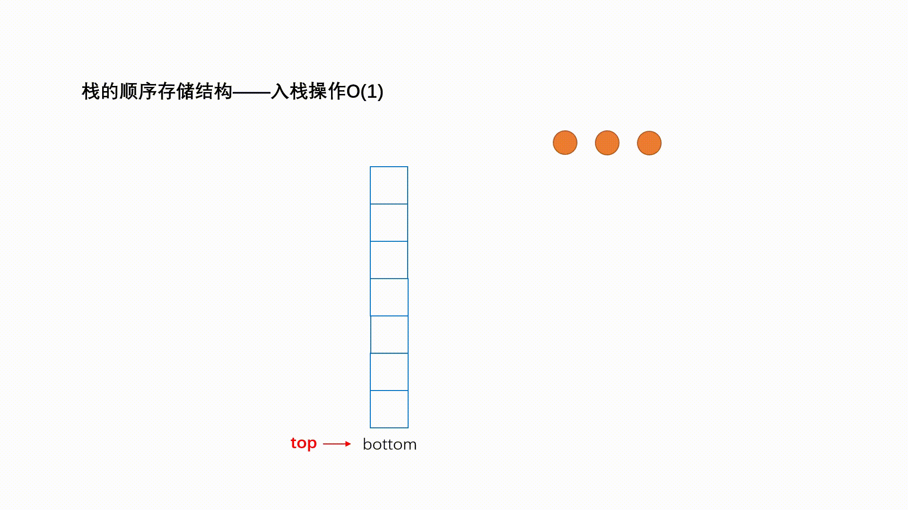
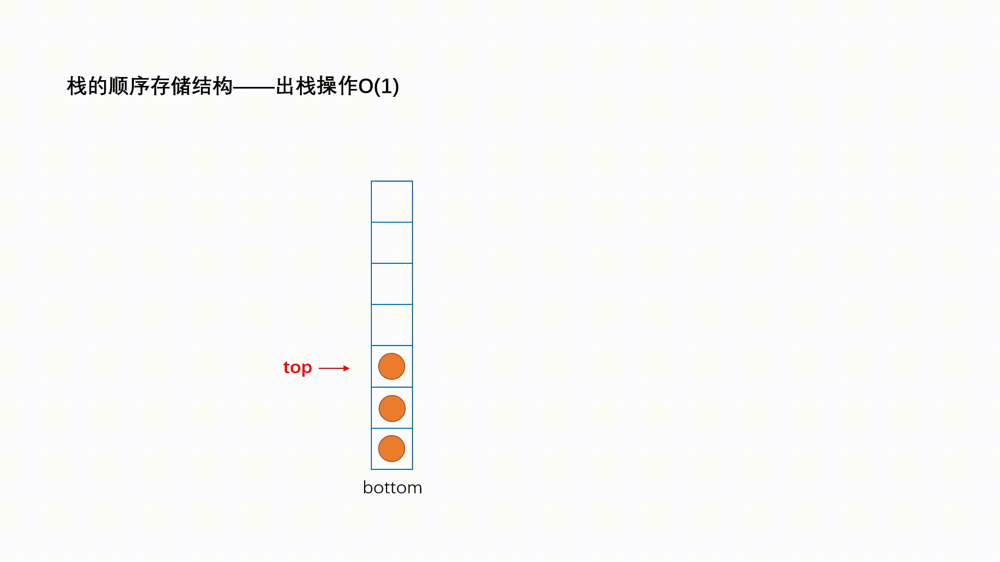

# Stack

[toc]

## 简介

### 相关算法

1. monotonic stack (解决最近一个最大最小的问题)
2. 维护额外变量的 stack (空间换时间)

### 适用范围

1. **Reverse a string**
2. **Check if the parentheses**
3. **Check if two binary trees are equal**

4. **Evaluate a postfix expression**

### 概念

- last in, first out (LIFO)
- sequentially dependent on each other

### 复杂度

| 方法 | 复杂度 |
| ---- | ------ |
| Pop  | O(1)   |
| Push | O(1)   |
| Peek | O(1)   |

### 现实联系

- **Checking code files:** Stacks are used in compilers to check if the parentheses in a code file are balanced.
- **Undo/redo functionality:** Stacks are commonly used to undo/redo things while editing.
- **Recursive call stacks:** The compiler internally calls stack itself when storing information about the recursion calls. Stacks facilitate recursive subroutines where the state of every call is gathered in a stack frame and then put on a stack.

## 方法

### java

| Modifier and Type | Method and Description            |
| :---------------- | :-------------------------------- |
| `void`            | `addFirst(E e)`                   |
| `void`            | `addLast(E e)`                    |
| `boolean`         | `contains(Object o)`              |
| `E`               | `getFirst()`                      |
| `E`               | `getLast()`                       |
| `E`               | `removeFirst()`                   |
| `boolean`         | `removeFirstOccurrence(Object o)` |
| `E`               | `removeLast()`                    |
| `boolean`         | `removeLastOccurrence(Object o)`  |

### push

### pop

### peek

## 实现

1. [Stack](https://github.com/KurisuZhang/LeetCode300/blob/main/code/src/Stack/_0_Stack.java)

------

