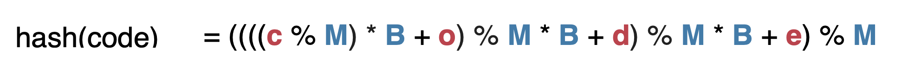

# Hash Table

## 简介

### 概念

**<u>哈希函数设计</u>**：

例子：code

code = **c** * 26^3 + **o** * 26^2 + **d** * 26^1 + **e** * 26^0
code = **c** * **B**^3 + **o** * **B**^2 + **d** * **B**^1 + **e** * **B**^0
hash(code) = ( **c** * **B**^3 + **o** * **B**^2 + **d** * **B**^1 + **e** * **B**^0 ) % **M**

<u>**哈希素数表：**</u>

| dec           | lwr  | upr  | % err     | prime      |
| ------------- | ---- | ---- | --------- | ---------- |
| 64            | 2^5  | 2^6  | 10.041667 | 53         |
| 128           | 2^6  | 2^7  | 1.041667  | 97         |
| 256           | 2^7  | 2^8  | 0.520833  | 193        |
| 512           | 2^8  | 2^9  | 1.302083  | 389        |
| 1024          | 2^9  | 2^10 | 0.130208  | 769        |
| 2048          | 2^10 | 2^11 | 0.455729  | 1543       |
| 4096          | 2^11 | 2^12 | 0.227865  | 3079       |
| 8192          | 2^12 | 2^13 | 0.113932  | 6151       |
| 16,384        | 2^13 | 2^14 | 0.008138  | 12289      |
| 32,768        | 2^14 | 2^15 | 0.069173  | 24593      |
| 65,536        | 2^15 | 2^16 | 0.010173  | 49157      |
| 131,072       | 2^16 | 2^17 | 0.013224  | 98317      |
| 262,144       | 2^17 | 2^18 | 0.002543  | 196613     |
| 524,288       | 2^18 | 2^19 | 0.006358  | 393241     |
| 1,048,576     | 2^19 | 2^20 | 0.000127  | 786433     |
| 2,097,152     | 2^20 | 2^21 | 0.000318  | 1572869    |
| 4,194,304     | 2^21 | 2^22 | 0.000350  | 3145739    |
| 8,388,608     | 2^22 | 2^23 | 0.000207  | 6291469    |
| 16,777,216    | 2^23 | 2^24 | 0.000040  | 12582917   |
| 33,554,432    | 2^24 | 2^25 | 0.000075  | 25165843   |
| 67,108,864    | 2^25 | 2^26 | 0.000010  | 50331653   |
| 134,217,728   | 2^26 | 2^27 | 0.000023  | 100663319  |
| 268,435,456   | 2^27 | 2^28 | 0.000009  | 201326611  |
| 536,870,912   | 2^28 | 2^29 | 0.000001  | 402653189  |
| 1,073,741,824 | 2^29 | 2^30 | 0.000011  | 805306457  |
| 2,147,483,648 | 2^30 | 2^31 | 0.000000  | 1610612741 |

**<u>解决哈希冲突：</u>**

1. Chaining
2. Open addressing
   1. Linear probing 
   2. Quadratic probing 
   3. Double hashing

### 复杂度

| 方法   | 复杂度 |
| ------ | ------ |
| Search | 1      |
| Insert | 1      |
| Delete | 1      |
| Add    | 1      |

### 相关算法

1. 重复元素
2. Rabin Karp (字符串匹配)
3. 

## 方法

| Modifier and Type     | Method and Description                     |
| :-------------------- | :----------------------------------------- |
| `V`                   | `put(K key, V value)`                      |
| `void`                | `putAll(Map<? extends K,? extends V> m)`   |
| `V`                   | `get(Object key)`                          |
| `V`                   | `getOrDefault(Object key, V defaultValue)` |
| `boolean`             | `containsKey(Object key)`                  |
| `boolean`             | `containsValue(Object value)`              |
| `V`                   | `remove(Object key)`                       |
| `V`                   | `replace(K key, V value)`                  |
| `Set<Map.Entry<K,V>>` | `entrySet()`                               |
| `Set<K>`              | `keySet()`                                 |
| `Collection<V>`       | `values()`                                 |

## 实现

1. [Hashing](https://github.com/KurisuZhang/LeetCode300/blob/main/code/src/ArryasHash/_0_Hashing.java)
2. [RabinKarp](https://github.com/KurisuZhang/LeetCode300/blob/main/code/src/ArryasHash/_0_RabinKarp.java)
