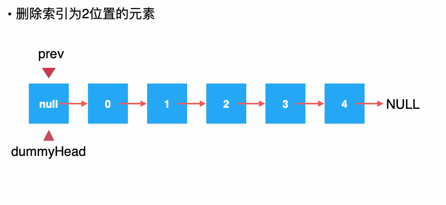

# Linked List

[toc]


## 简介

### 相关算法

1. [inPlace Reverse](###Reverse)
2. Fast Slow Pointer


### 适用范围

1. 动态数组
2. 如果对第一个元素操作 O(1)


### 概念

- *A linked list is a linear data structure, in which the elements are not stored at contiguous memory locations.*

  

### 复杂度

| 方法 | 复杂度 |
| ---- | ------ |
| 增   | O(n)   |
| 删   | O(n)   |
| 改   | O(n)   |
| 查   | O(n)   |

### 现实联系


## 方法

### add


```java
if (index < 0 || index > size)
    throw new IllegalArgumentException("Add failed. Illegal index.");

Node prev = dummyHead;
for (int i = 0; i < index; i++)
    prev = prev.next;

prev.next = new Node(e, prev.next);
size++;
```


### remove



```java
if (index < 0 || index >= size)
    throw new IllegalArgumentException("Remove failed. Index is illegal.");

Node prev = dummyHead;
for (int i = 0; i < index; i++)
    prev = prev.next;

Node retNode = prev.next;
prev.next = retNode.next;
retNode.next = null;
size--;

return retNode.e;
```

### Reverse

```java
ListNode previous = null;
ListNode next = null;
ListNode current = head;

while (current != null) {
    next = current.next; // temporarily store the next node
    current.next = previous; // reverse the current node
    previous = current; // before we move to the next node, point previous to the current node
    current = next; // move on the next node
}

return previous;
```


## 实现

1. [Linked List](https://github.com/KurisuZhang/LeetCode300/blob/main/code/src/LinkedList/_0_LinkedList.java)
2. 


------


