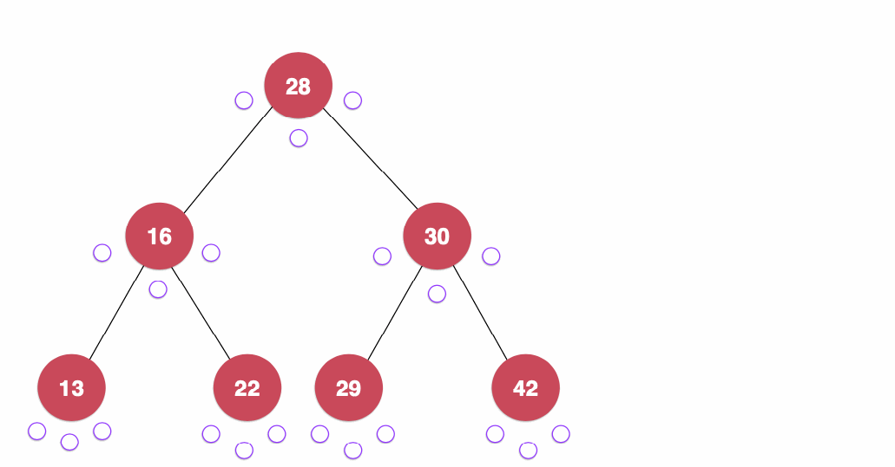
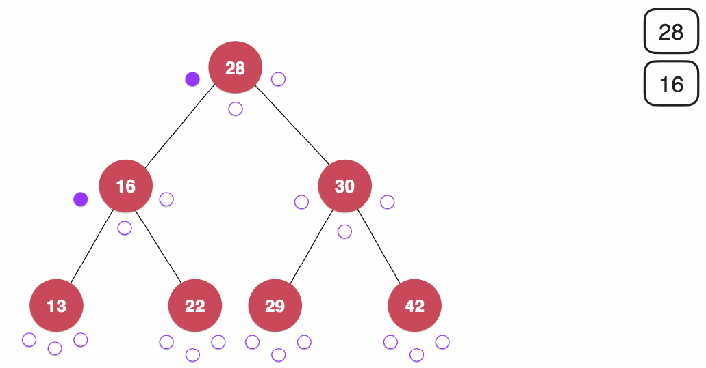
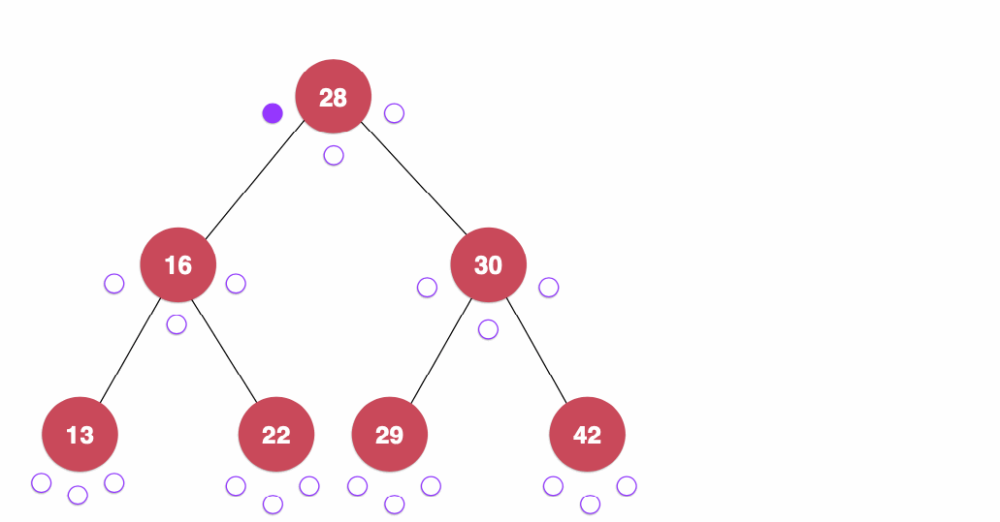
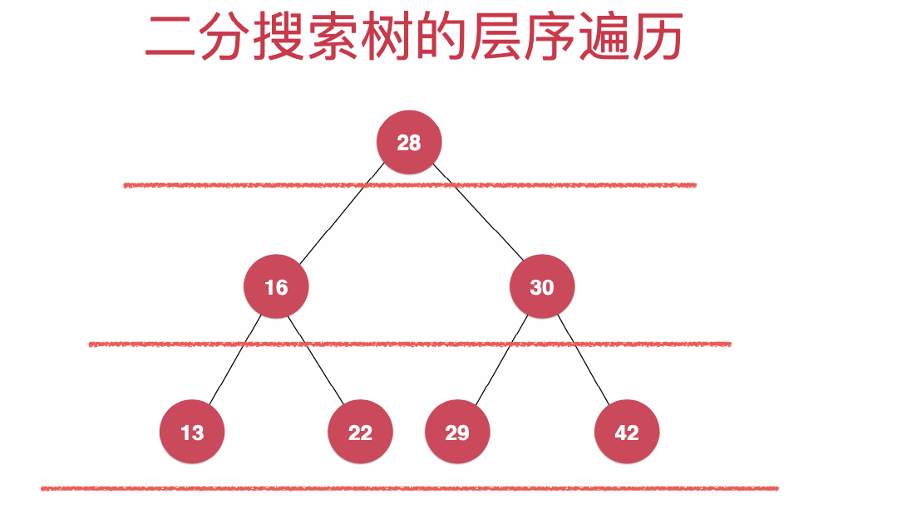

# Binary Search Tree

[toc]


## 简介

### 概念

- 二分搜索树的每个节点的值:
  - 大于其左子树的所有节点的值
  - 小于其右子树的所有节点的值
- 二叉树不一定是“满”的


### 复杂度

| 方法        | 复杂度 |
| ----------- | ------ |
| Add         | O(h)   |
| Delete      | O(h)   |
| Max         | O(h)   |
| Min         | O(h)   |
| Predecessor | O(h)   |
| Succesor    | O(h)   |
| Seach       | O(h)   |


### 相关算法

1. BFS
2. DFS


## 方法

### Add


```java
// 添加新的元素e
public void add(E e){
    root = add(root, e);
}

// 递归
private Node add(Node node, E e){
    // 递归终止条件
    if(node == null){
        size ++;
        return new Node(e);
    }
    // 递归范围缩小
    if(e.compareTo(node.e) < 0)
        node.left = add(node.left, e);
    else if(e.compareTo(node.e) > 0)
        node.right = add(node.right, e);
    
    // 维护size
    node.sz = size(node.left) + size(node.right) + 1;

    return node;
}
```


### max/delete_max

```java
// 寻找二分搜索树的最大元素
public E maximum(){
    if(size == 0)
        throw new IllegalArgumentException("BST is empty");

    return maximum(root).e;
}

// 返回以node为根的二分搜索树的最大值所在的节点
private Node maximum(Node node){
    if(node.right == null)
        return node;

    return maximum(node.right);
}

// 从二分搜索树中删除最大值所在节点
public E removeMax(){
    E ret = maximum();
    root = removeMax(root);
    return ret;
}

// 删除掉以node为根的二分搜索树中的最大节点
// 返回删除节点后新的二分搜索树的根
private Node removeMax(Node node){

    if(node.right == null){
        Node leftNode = node.left;
        node.left = null;
        size --;
        return leftNode;
    }

    node.right = removeMax(node.right);
    node.sz = size(node.left) + size(node.right) + 1;
    return node;
}
```


### min/delete_min

````java
// 寻找二分搜索树的最小元素
public E minimum(){
    if(size == 0)
        throw new IllegalArgumentException("BST is empty!");

    return minimum(root).e;
}

// 返回以node为根的二分搜索树的最小值所在的节点
private Node minimum(Node node){
    if(node.left == null)
        return node;
    return minimum(node.left);
}

// 从二分搜索树中删除最小值所在节点, 返回最小值
public E removeMin(){
    E ret = minimum();
    root = removeMin(root);
    return ret;
}

// 删除掉以node为根的二分搜索树中的最小节点
// 返回删除节点后新的二分搜索树的根
private Node removeMin(Node node){

    if(node.left == null){
        Node rightNode = node.right;
        node.right = null;
        size --;
        return rightNode;
    }

    node.left = removeMin(node.left);
    node.sz = size(node.left) + size(node.right) + 1;
    return node;
}
````


### 删除

三种情况:

1. 没有子节点
2. 只有一个子节点
3. 有两个子节点

```java
// 从二分搜索树中删除元素为e的节点
public void remove(E e){
    root = remove(root, e);
}

// 删除掉以node为根的二分搜索树中值为e的节点, 递归算法
// 返回删除节点后新的二分搜索树的根
private Node remove(Node node, E e){

    if( node == null )
        return null;

    Node retNode = null;
    if( e.compareTo(node.e) < 0 ){
        node.left = remove(node.left , e);
        retNode = node;
    }
    else if(e.compareTo(node.e) > 0 ){
        node.right = remove(node.right, e);
        retNode = node;
    }
    else{   // e.compareTo(node.e) == 0

        // 待删除节点左子树为空的情况
        if(node.left == null){
            Node rightNode = node.right;
            node.right = null;
            size --;
            retNode = rightNode;
        }

        // 待删除节点右子树为空的情况
        else if(node.right == null){
            Node leftNode = node.left;
            node.left = null;
            size --;
            retNode = leftNode;
        }
        
        // 待删除节点左右子树均不为空的情况
        else {
            // 找到比待删除节点大的最小节点, 即待删除节点右子树的最小节点
            // 用这个节点顶替待删除节点的位置
            Node successor = minimum(node.right);
            successor.right = removeMin(node.right);
            successor.left = node.left;

            node.left = node.right = null;
            retNode = successor;
        }
    }

    node.sz = size(node.left) + size(node.right) + 1;
    return retNode;
}
```


### 遍历


**Inorder** (sort):

left, root, right

```java
private void inOrder(Node node){

    if(node == null)
        return;
    inOrder(node.left);
    System.out.println(node.e);
    inOrder(node.right);
}
```



**Preorder** (root to leave,):
root, left, right

```java
private void preOrder(Node node){

    if(node == null)
        return;
    
    System.out.println(node.e);
    preOrder(node.left);
    preOrder(node.right);
}
```



**Postorder**:
left, right, root

```java
private void postOrder(Node node){

    if(node == null)
        return;
    
    System.out.println(node.e);
    postOrder(node.left);
    postOrder(node.right);
}
```



**LevelOrder**:



## 实现

1.BST[7.Map](../../../code/src/Tree/BST.java)