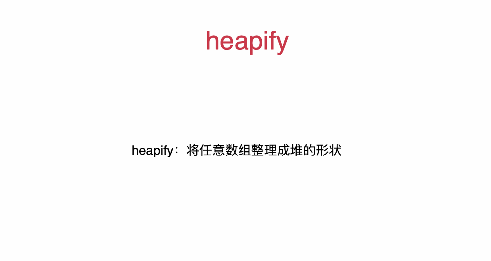
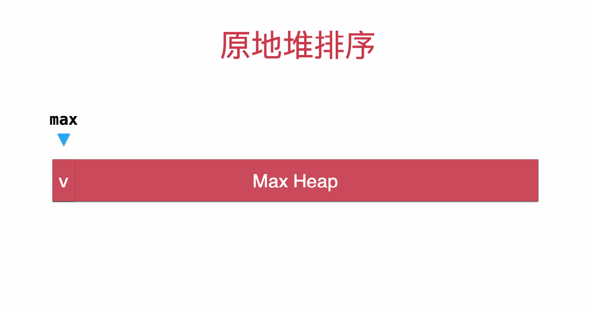

# Heap

[toc]


## 简介

### 相关算法

1. **Two heaps**
2. **K-way Merge** 
3. **Top/Bottom K Elements**
4. Median 


### 适用范围


### 概念


**Add** 和 **extractMax**/**Min** 时间复杂度都是 **O(logn)**

heapify的过程，算法复杂度为O(n)

### 复杂度

| 方法       | 复杂度       |
| ---------- | ------------ |
| **Insert** | **O(log N)** |
| **Delete** | **O(log N)** |
|            |              |

### 现实联系


## 方法

## Sift up (add)


```java
// 向堆中添加元素
public void add(E e){
    data.addLast(e);
    siftUp(data.getSize() - 1);
}

private void siftUp(int k){
    // !!!
    while(k > 0 && data.get(parent(k)).compareTo(data.get(k)) > 0 ){
        data.swap(k, parent(k));
        k = parent(k);
    }
}
```


## Sift down (extract)


```java
// !!!
// 看堆中的最小元素
public E findMin(){
    if(data.getSize() == 0)
        throw new IllegalArgumentException("Can not findMax when heap is empty.");
    return data.get(0);
}

// 取出堆中最小元素
public E extractMin(){

    E ret = findMin();

    data.swap(0, data.getSize() - 1);
    data.removeLast();
    siftDown(0);

    return ret;
}

private void siftDown(int k){

    while(leftChild(k) < data.getSize()){
        int j = leftChild(k); // 在此轮循环中,data[k]和data[j]交换位置
        // !!!
        if( j + 1 < data.getSize() &&
                data.get(j + 1).compareTo(data.get(j)) < 0 )
            j ++;
        // data[j] 是 leftChild 和 rightChild 中的最小值

        // !!!
        if(data.get(k).compareTo(data.get(j)) <= 0 )
            break;

        data.swap(k, j);
        k = j;
    }
}
```


## Heapify



```
```


## HeapSort



##

## 实现

1. [Heap](https://github.com/KurisuZhang/LeetCode300/blob/main/code/src/HeapPQ/_0_MinHeap.java)


------


