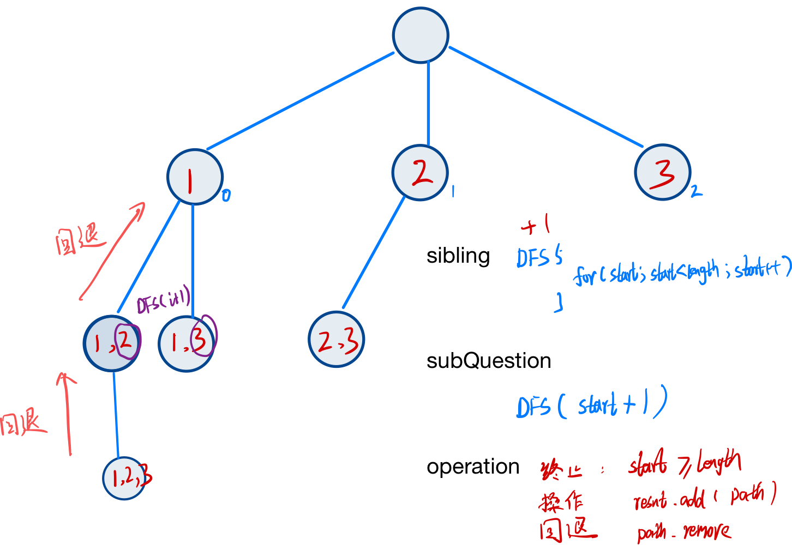

# Backtracking

[toc]


## 简介

### 相关算法

1. Subset 
2. Permutation 
3. Combination 


### 适用范围

- While constructing any single candidate solution, all paths must be explored. That is, if exploring a certain path results in a deadend, we need to move back one level and explore all the other paths in the solution space.
- The problem requires us to consider all feasible solutions in order to select the best one. Doing so, not a single feasible solution may be ignored. In certain problems, even if some feasible solutions are eventually discarded, we still need to find and evaluate them.
- The problem requires us to compile a list of all feasible solutions.


### 概念

**Backtracking** is a technique that explores multiple paths to find the solution. It builds the solution step by step by increasing values with time and removes the choices that don’t contribute to the problem’s solution based on some constraints.

### 复杂度

| 方法 | 复杂度 |
| ---- | ------ |
|      |        |

### 现实联系

**Constraint satisfaction problems:** Backtracking is used to solve puzzles, such as sudoku, where we enter a number into a cell, backtrack if it violates the rules, and try again to find a valid path that satisfies the conditions.

**Recursive descent parsers:** The compiler takes a path through the grammar and reaches a point where the incoming tokens no longer match that part of the grammar. Therefore, the compiler backtracks to a point where there is another path through the grammar and follows that. This can occur several times until the compiler finds a grammar path that fits the incoming tokens, in which case it accepts the construct. If it finds no matching path, a syntax error is shown.


## 相关问题

1. Subset 

   

## 模板

```java
List<List<Integer>> result = new ArrayList<>();
List<Integer> path = new ArrayList<>();
// 存是否访问过
boolean[] isVisit;
int[] nums; 

public List<List<Integer>> permute(int[] nums) {
    this.nums = nums;
    this.isVisit = new boolean[nums.length];
    Arrays.fill(isVisit, false);

    dfs(0);

    return result;
}


public void dfs(int start){
    
    // 终止条件
    if () {
        result.add();
        return;
    }

    for (; start < nums.length; start++) {]
        // 访问过的不再访问
        if (!isVisit[start]){
            // 题操作
            int num = nums[start];
            path.add(num);
            isVisit[start] = true;
            // 0, start, start+1
            dfs(0);
            // 回退操作
            isVisit[start] = false;
            path.remove(path.size() - 1);
        }
    }
    
}
```


------

