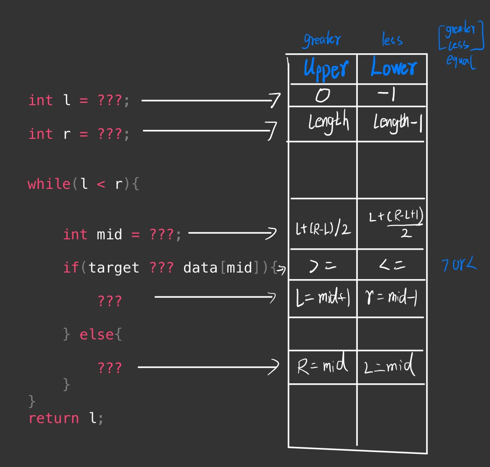

# Binary Search

[toc]

## 简介

### 概念

- search for a target value in an array
- 


### 适用范围

- 在排过序的 Array 里找一个值
- Array 也可以部分排序

### 复杂度

#### Time complexity

The time complexity of both approaches is O(log(n))

#### Space complexity

The space complexity of the iterative solution is O(1)

### 现实联系

- **Dictionary:** A dictionary contains words that are alphabetically sorted. Therefore, we can use binary search to get to the required word quickly.
- **Debugging with minimal support:** Let’s suppose that a code script consists of n*n* lines, and that there is a bug somewhere in the script. Binary search is performed to find the bug by dividing the code based on the line numbers. For example, if the code does not run for the first n/2*n*/2 lines, we further divide the code and check if it runs for the first n/4*n*/4 lines and so on.
- **Student documents:** Sort the documents in order of the students’ roll numbers and apply binary search to search for a particular student’s document.

## 相关问题

### 基本型

```java
int l = 0;
int r = data.length - 1;

// 在 data[l, r] 的范围中查找 target
while(l <= r){

    int mid = l + (r - l) / 2;

    if(target == data[mid]){
        return mid;
        
    }else if(target > data[mid]){
        l = mid + 1;
        
    }else{
        r = mid - 1;
    }     
}

return -1;
```


### upper

```java
// > target 的最小值索引

int l = 0
int r = data.length;

while(l < r){

    int mid = l + (r - l) / 2;

    if(target >= data[mid]){
        l = mid + 1;

    }else{
        r = mid;
    }        
}

return l;
```


### lower

```java
// < target 的最大值索引
int l = -1;
int r = data.length - 1;


while(l < r){

    //+1
    int mid = l + (r - l + 1) / 2;

    if(target <= data[mid]){
        r = mid - 1;

    } else{
        l = mid;
    }
}
return l;
```


### 部分 sort

```java
        int start = 0;
        int end = nums.length - 1;

        while (start <= end) {

            int mid = start + (end - start) / 2;
            // 找到返回
            if (target==nums[mid]){
                return mid;
            }
            // 先判断前半段是否 sorted
            if (nums[start] <= nums[mid]) {
                // 判断是否在前半段区间
                if (target >= nums[start]&& target < nums[mid]) {
                    end = mid - 1;
                } else {
                    start = mid + 1;
                }
            }
            // 前半段不是 sorted
            else {
                // 判断是否在后半段区间
                if ( target > nums[mid] && target <= nums[end]){
                    start = mid + 1;
                } else{
                    end = mid - 1;
                }
            }
        }
        return - 1;
```


## 模板



```java

```

