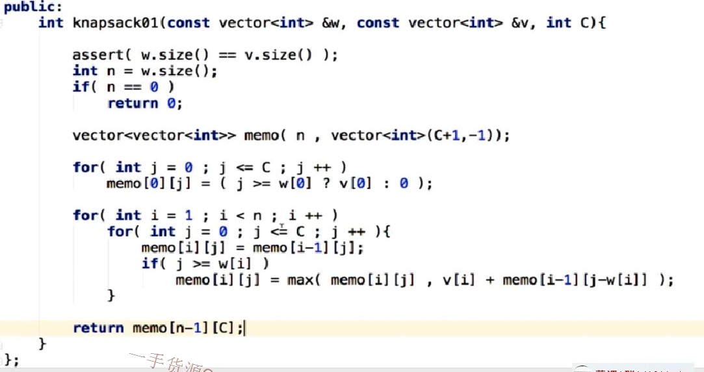

# Dynamic Programming

[toc]

## 简介

### 概念

- the solution to a smaller problem helps us solve the bigger one
- Top-down approach with memoization
- Bottom-up approach with tabulation

### 适用范围

- Overlapping subproblems, that is, we can use the results of one subproblem when solving another, possibly larger subproblem.
- Optimal substructure, that is, if the final solution can be constructed from the optimal solutions to its subproblems.

### 复杂度


### 现实联系

- **Load Balancer:** Find the optimal way to handle a given workload by using servers with different workload handling capacities.

- **Search Engine:** Check if white spaces can be added to a query to create valid words in case the original query does not get any hits on the web. Find all the possible queries that can be created by adding white spaces to the original query.

  

## 相关问题

1. 1D


1. 2D



## 模板

1d

```java
int[] dp = new int[nums.length];
dp[0] = nums[0];
dp[1] = Math.max(dp[0], nums[1]);

for (int i = 2; i < nums.length; i++) {
    dp[i] = Math.max(dp[i - 1], dp[i - 2] + nums[i]);
}

return dp[nums.length-1];
```

2d

```java
int[][] dp = new int[text2.length() + 1][text1.length() + 1];

for (int i = 0; i < text1.length()+1; i++) {
    dp[0][i] = 0;
}
for (int i = 0; i < text2.length() + 1; i++) {
    dp[i][0] = 0;
}

for (int i = 1; i < text2.length() + 1; i++) {
    for (int j = 1; j < text1.length() + 1; j++) {

		if (text2.charAt(i - 1) == text1.charAt(j - 1)) {
            dp[i][j] = dp[i - 1][j - 1];
            dp[i][j] = dp[i][j] + 1;
        } else {
            dp[i][j] = Math.max(dp[i][j - 1], dp[i - 1][j]);
        }
    }
}
```


------

