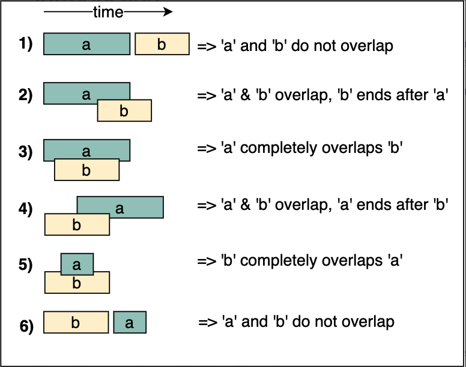
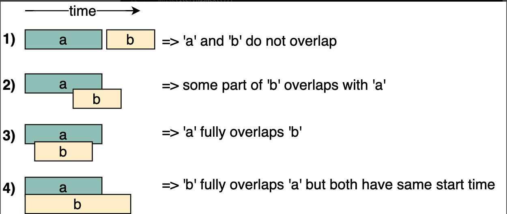

# Merge Interval

[toc]

## 简介

### 概念

- The **merge intervals** pattern deals with problems involving overlapping intervals. Each interval is represented by a start and an end time. 

两个区间关系的6 种情况



sort 过后的情况



### 适用范围

- The input data is an array of intervals.
- The problem requires dealing with overlapping intervals, either to find their intersection, their union, or the gaps between them. This may be required as the final goal, or as an intermediate step in the computation of intervals.

### 复杂度

复杂度, o(n) + sort 

### 现实联系

- **Display busy schedule:** Display the busy hours of a user to other users without revealing the individual meeting slots in a calendar.
- **Schedule a new meeting:** Add a new meeting to the tentative meeting schedule of a user in such a way that no two meetings overlap each other.
- **Task scheduling in operating systems (OS):** Schedule tasks for the OS based on task priority and the free slots in the machine’s processing schedule.

## 相关问题

Sort(单个)

> first_end >= second_start

sort(两个)

> // 存在交集条件
> a_起始 <= b_起始 && a_结束 >= b_起始
> b_起始 <= a_起始 && b_结束 >= a_起始
>
> // 截取交集
> start = max(a.start, b.start)
> end = min(a.end, b.end) 


## 模板

```java

```


------

