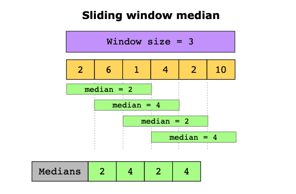
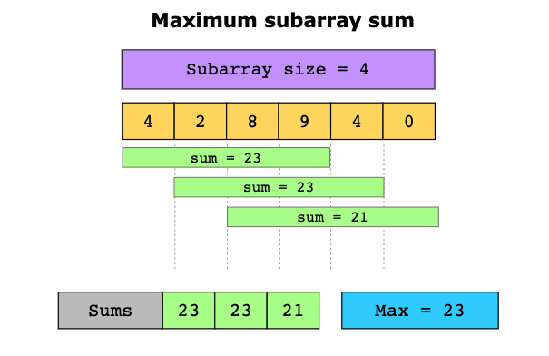

# Sliding Window

[toc]

## 简介

### 概念

- **<u>求连续空间的某种性质</u>**, 重复使用前面已经计算过的结果。 减去不需要的， 加上新增加的。

### 复杂度

**Time complexity**

The time complexity is O(n)

**Space complexity**

The space complexity is O(k)

### 适用范围

- 求连续空间的某种性质

### 现实联系

- **Telecommunications:** Find the maximum number of users connected to a cellular network’s base station in every k*k*-millisecond sliding window.
- **E-commerce:** Given a dataset of product IDs in the order they were viewed by the user and a list of products that are likely to be similar, find how many times these products occur together in the dataset.
- **Video streaming:** Given a stream of numbers representing the number of buffering events in a given user session, calculate the median number of buffering events in each one-minute interval.
- **Social media content mining:** Given the lists of topics that two users have posted about, find the shortest sequence of posts by one user that includes all the topics that the other user has posted about.

## 相关问题

1. **Sliding window median**

   

2. **Maximum subarray sum**



## 模板

```java
// 1. 初始化变量
int result = 0;
int startPoint = 0;

// 2. 根据数组长度循环遍历数组
for (int endPoint = 0; endPoint < nums.length; endPoint++) {
    
    // 3.根据规则处理数据, 增加窗口内的元素
    result = result + nums[endPoint];
    
    // 4. 当满足某地条件时, 循环的缩小窗口大小
    while (result?????) {
        // 5. 存储想要的结果
        可能是长度, 可用 max or min, 可能是元素,用数据结构
        // 6. 缩减窗口的长度
        result -= nums[startPoint];
        // 7. 前进 start point
        startPoint++;
    }
    
    //更新
}

return 结果
```


------

