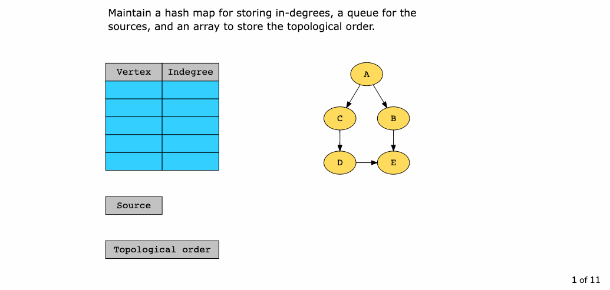

# Topological Sort

[toc]

## 简介

### 概念

- The **topological sort** pattern is used to find valid orderings of elements that have dependencies on, or priority over each other. Scheduling and grouping problems that have prerequisites or dependencies generally fall under this pattern.



Graph:  parent -> child

inDegree: child +1 (满)

### 适用范围

- **Course prerequisites**
- [ Alien Dictionary](https://leetcode.com/problems/alien-dictionary)

### 复杂度

Time complexity

 O*(*V*+*E)

Space complexity

*O*(*V*)

### 现实联系

1.

## 相关问题

1. 

## 模板

```java
// prerequisites[i] = [ai, bi]
// you must take course bi first if you want to take course ai

// result
List<Integer> result = new ArrayList<>();
// two hashmap
HashMap<Integer, List<Integer>> graph = new HashMap<>();
HashMap<Integer, Integer> inDegree = new HashMap<>();

// 1. Initialize the graph, count of incoming
for (int i = 0; i < prerequisites.length; i++) {
    int parent = prerequisites[i][1];
    int child = prerequisites[i][0];
    graph.put(parent, new ArrayList<>());
    graph.put(child, new ArrayList<>());
    inDegree.put(parent, 0);
    inDegree.put(child, 0);
}

// b. Build the graph, and inDegree
for (int i = 0; i < prerequisites.length; i++) {
    int parent = prerequisites[i][1];
    int child = prerequisites[i][0];
    graph.get(parent).add(child);
    inDegree.put(child, inDegree.get(child) + 1);
}

// c. Find all sources, all vertices with 0 in-degrees
Deque<Integer> deque = new ArrayDeque<>();
for (Integer i : inDegree.keySet()) {
    if (inDegree.get(i) == 0) {
        deque.addLast(i);
    }
}

// d. For each source, add it to the result and subtract one from all of its children's in-degrees
// if a child's in-degree becomes zero, add it to the deque
while (!deque.isEmpty()){
    int element = deque.removeFirst();
    result.add(element);

    for (int i = 0; i < graph.get(element).size(); i++) {
        // table -1
        int child = graph.get(element).get(i);
        inDegree.put(child, inDegree.get(child) - 1);
        // determine whether is 0 in-degrees
        if (inDegree.get(child) == 0) {
            deque.addLast(child);
        }
    }
}
if(result.size() != graph.size()){
    return new ArrayList<>();
}
return result;
```


------

