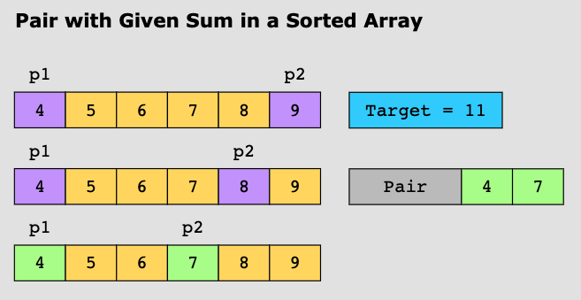

# Two Pointers

[toc]

## 简介

### 概念

- Uses two pointers to iterate until the conditions of the problem are satisfied
- Find two data elements in an array that satisfy a certain condition.

### 复杂度

**Time complexity**

The time complexity is O(n) where n*n* is the number of characters present in the string.

**Space complexity**

The space complexity is O(1)) because we use constant space to store two indices.

### 适用范围

- The input data can be traversed in a linear fashion.
- The input data is sorted, or else, arranged in a way that is relevant to the problemy.

### 现实联系

1.**Transmission errors:**

2.**Product suggestions:**

## 相关问题

1. **Reversing an Array** (palindrome.)

   

2. **Pair with Given Sum in a Sorted Array** (two sum)

   

## 模板

```java
import java.util.*;
class TwoPointers{
    static void twoPointers(String s1){
        int left = 0;
        int right = s1.length() - 1; // legth -1
        while (left <= right){
            left = left + 1;
            right = right -1;
        }
    }
}
```


------

