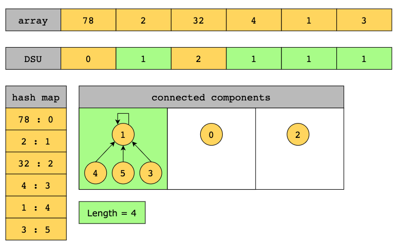

# Union Find

[toc]

## 简介

### 概念

- The **union find** pattern is used to group elements into sets based on a specified property. Each set is non-overlapping, that is, it contains unique elements that are not present in any other set. The pattern uses a disjoint set data structure such as an array, to keep track of which set each element belongs to.

**find(x):** Finds the representative of the set that contains x.

**union(x, y):** Merges the sets of x and y into one.




### 适用范围

1. 是否联通

2. 是否存在环

- The problem requires arranging elements with a certain property into groups, or, to use graph terminology, into connected components.
- We have been given a problem that contains elements represented as separate sets initially where we have to combine pairs of sets or find whether two elements belong to the same set or not.
- The problem data is best organized in the form of a graph, yet the data has not been provided in the form of an adjacency list/matrix.

### 复杂度

 time complexity down to O*(*log(n))

### 现实联系

1.

## 相关问题

1. 

## 模板

```java
// 我们的第四版Union-Find
public class UnionFind4 implements UF {

    private int[] rank;   // rank[i]表示以i为根的集合所表示的树的层数
    private int[] parent; // parent[i]表示第i个元素所指向的父节点

    // 构造函数
    public UnionFind4(int size){

        rank = new int[size];
        parent = new int[size];

        // 初始化, 每一个parent[i]指向自己, 表示每一个元素自己自成一个集合
        for( int i = 0 ; i < size ; i ++ ){
            parent[i] = i;
            rank[i] = 1;
        }
    }

    @Override
    public int getSize(){
        return parent.length;
    }

    // 查找过程, 查找元素p所对应的集合编号
    // O(h)复杂度, h为树的高度
    private int find(int p){
        if(p < 0 || p >= parent.length)
            throw new IllegalArgumentException("p is out of bound.");

        // 不断去查询自己的父亲节点, 直到到达根节点
        // 根节点的特点: parent[p] == p
        while(p != parent[p])
            p = parent[p];
        return p;
    }

    // 查看元素p和元素q是否所属一个集合
    // O(h)复杂度, h为树的高度
    @Override
    public boolean isConnected( int p , int q ){
        return find(p) == find(q);
    }

    // 合并元素p和元素q所属的集合
    // O(h)复杂度, h为树的高度
    @Override
    public void unionElements(int p, int q){

        int pRoot = find(p);
        int qRoot = find(q);

        if( pRoot == qRoot )
            return;

        // 根据两个元素所在树的rank不同判断合并方向
        // 将rank低的集合合并到rank高的集合上
        if(rank[pRoot] < rank[qRoot])
            parent[pRoot] = qRoot;
        else if(rank[qRoot] < rank[pRoot])
            parent[qRoot] = pRoot;
        else{ // rank[pRoot] == rank[qRoot]
            parent[pRoot] = qRoot;
            rank[qRoot] += 1;   // 此时, 我维护rank的值
        }
    }
}

```


------

